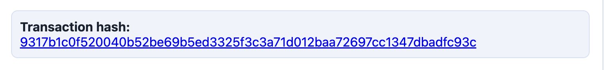

# Stellar White Belt dApp (React + Vite)

Level 1 (White Belt) Stellar dApp that runs on **Stellar Testnet** and implements:

- Freighter wallet connect + disconnect
- Fetch + display the connected wallet's XLM balance (testnet)
- Send an XLM payment on Stellar testnet
- Transaction feedback (success/failure + transaction hash, linked to explorer)

## Setup (Run Locally)

### Clone

```bash
git clone https://github.com/notcodesid/stellar-white-belt-dapp.git
cd stellar-white-belt-dapp
```

### Prerequisites

1. Install the Freighter browser extension.
2. In Freighter, switch network to **Testnet**.
3. Fund your account via Friendbot (testnet) so it exists on-chain.


### Install + Run

```bash
npm install
npm run dev
```

Open: <http://localhost:4173>

## Screenshots

Screenshots from a local run.

### Wallet Connected


### Balance Displayed


### Successful Testnet Transaction


### Transaction Result Shown


